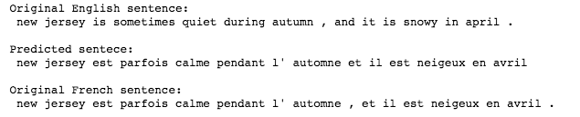
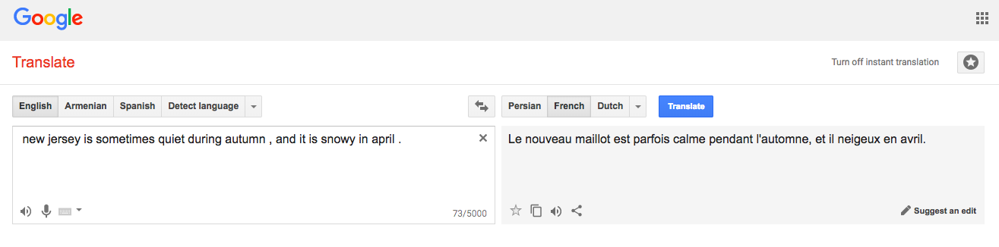

# Machine Translation
Machine Translation (MT) is the task of automatically converting one natural language into another, preserving the meaning of the input text, and producing fluent text in the output language. While machine translation is one of the oldest subfields of artificial intelligence research, the recent shift towards large-scale empirical techniques has led to very significant improvements in translation quality. (text taken from <a href = "https://nlp.stanford.edu/projects/mt.shtml">Standford (NLP webpage)</a>. )

# Result
The model shows a 98% accuracy rate on training set and 97% percent accuracy rate on validation set. below you can see a translation sample from the algorithm presented here and also the result of same sample from google translate.

 

 <b>Fig.1</b> - Translating a sample sentence with the <b>algorithm presented here</b>. 

 

<figure>
  
  <figcaption><b>Fig.2</b> - Translating a sample sentence with the <b>Google Translate</b>. </figcaption>
</figure>
